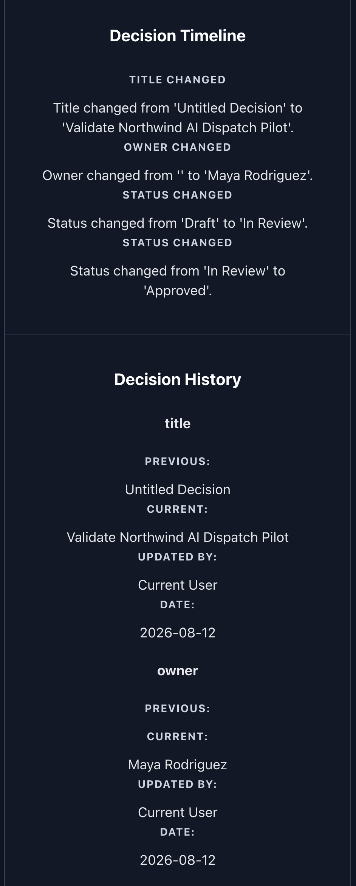

# AI Decision Journal

> **Enterprise decision intelligence workspace for governing, tracing, and learning from organizational decisions.**

**Built with:** React • Node.js • Express • Supabase • PostgreSQL

---

# Overview

AI Decision Journal is an enterprise decision intelligence application for capturing important organizational decisions as governed, durable records.

Business decisions often begin in meetings, email threads, documents, dashboards, and AI conversations. The final decision may be recorded somewhere, but the reasoning that produced it, the people responsible for it, the changes it passed through, and the outcome that followed are often fragmented or lost.

AI Decision Journal treats the **Decision itself as an organizational artifact**.

Each Decision can preserve its business context, supporting evidence, AI recommendation, human governance, accountable owner, lifecycle state, implementation outcome, change history, and lessons learned.

The result is a workspace designed to answer not only:

**What did we decide?**

but also:

- Why did we decide it?
- What evidence informed the decision?
- Who was accountable for it?
- How did the decision change?
- Was the decision properly governed?
- What happened after implementation?
- What should the organization learn from the result?

---

# Highlights

- Structured enterprise Decision records
- Searchable Decision Library
- Explicit Decision lifecycle
- Domain-enforced lifecycle transitions
- Decision change detection
- Lifecycle event generation
- Durable Decision history
- AI-assisted recommendations with human governance
- Accountable Decision ownership
- Operational outcome tracking
- Structured lessons learned
- Supabase-backed persistence
- Layered domain and application architecture

---

# Product Walkthrough

The screenshots below use **Northwind Logistics**, a fictional transportation and logistics organization, to demonstrate how an AI-assisted operational decision can move from organizational context through governance, implementation, observation, and learning.

## Enterprise Decision Workspace


The application combines a searchable Decision Library with a structured workspace for reviewing and managing individual organizational decisions.

Each Decision exists as more than a document or form. It is a persistent business record with identity, ownership, lifecycle state, governance information, operational outcomes, and historical context.

---

## Structured Decision Record


A Decision begins with the information necessary to understand the business problem being evaluated.

The workspace captures:

- Decision title
- Accountable owner
- Lifecycle status
- Decision type
- Priority
- Executive summary
- Decision question
- Business context
- Supporting evidence

This establishes a durable organizational record before governance and implementation occur.

---

## Decision Governance


AI-generated recommendations are represented separately from human organizational judgment.

The governance workspace can preserve:

- AI recommendation
- Supporting rationale
- Final organizational decision
- Reviewer
- Review date

The application is designed around the principle that AI can inform organizational judgment without obscuring human responsibility for the final decision.

---

## Lifecycle and Decision History



Meaningful changes to a Decision can become part of its durable organizational history.

The application detects changes between the persisted Decision and the edited working Decision. Relevant changes can then be represented as lifecycle events and projected into human-readable timeline and history records.

Examples include:

- Decision title changes
- Ownership changes
- Lifecycle transitions

Lifecycle transitions are validated against explicit domain rules before persistence.

An invalid transition is rejected without persisting the invalid state or generating false timeline and history records.

This allows the system to preserve not merely the current state of a Decision, but meaningful information about **how that state evolved**.

---

## Operational Outcomes


Governance does not end when a Decision is approved.

The application preserves what happens after organizational judgment becomes operational action.

Outcome tracking includes:

- Implementation status
- Expected outcome
- Actual outcome
- Outcome date

This connects the reasoning behind a Decision to the operational result that followed it.

---

## Organizational Learning


Completed work can produce structured organizational learning.

Lessons Learned capture:

- Key lesson
- What worked
- What did not work
- Recommended adjustment

This creates a feedback loop between past organizational decisions and future judgment.

---

# The Core Idea

Organizations are generally good at preserving artifacts such as:

- Documents
- Policies
- Standard Operating Procedures
- Project plans
- Technical specifications
- Transactional records

They are often much worse at preserving the reasoning behind consequential decisions.

Months later, teams may know **what** happened while no longer knowing:

- Why a particular option was selected
- What evidence supported the choice
- Who owned the decision
- How the decision evolved
- Whether implementation produced the expected result
- What the organization learned afterward

AI Decision Journal explores a simple architectural premise:

> **Important organizational decisions should be treated as durable organizational assets.**

That means preserving the Decision across its lifecycle rather than recording only its final state.

---

# Decision Lifecycle

Decision lifecycle state is modeled explicitly in the domain layer.

```text
Draft
  │
  ▼
In Review
  │
  ▼
Approved
  │
  ▼
Implemented
  │
  ▼
Observed
  │
  ▼
Completed
```

The lifecycle is not simply a list of labels.

Allowed transitions are defined as domain rules:

```text
Draft → In Review

In Review → Draft
In Review → Approved

Approved → Implemented

Implemented → Observed

Observed → Completed
```

Arbitrary lifecycle jumps are rejected.

For example:

```text
Approved ──X──> Completed
```

cannot bypass the required implementation and observation states.

This keeps the persisted Decision, timeline, and history consistent with the lifecycle represented by the domain.

---

# Change Detection and Lifecycle Events

A central architectural capability of the application is distinguishing between the Decision that was previously persisted and the Decision currently being edited.

The save path can be represented conceptually as:

```text
Persisted Decision
        │
        │ compare
        ▼
Working Decision
        │
        ▼
Difference Detection
        │
        ▼
Lifecycle Validation
        │
        ▼
Lifecycle Event Construction
        │
        ▼
Timeline / History Projection
        │
        ▼
Persistence
```

This separates responsibilities that would otherwise become mixed together inside UI components or database operations.

### Difference Detection

The domain determines which meaningful Decision properties changed.

### Lifecycle Validation

Status changes are checked against the allowed Decision lifecycle before persistence.

### Lifecycle Events

Accepted changes can be represented as structured lifecycle events.

### Projection

Lifecycle events are transformed into the timeline and history representations used by the Decision record.

### Persistence

Only after validation and projection is the resulting Decision persisted through the repository boundary.

This is intentionally **not an event-sourced architecture**.

The Decision remains the primary persisted aggregate. Lifecycle events and projections provide structured historical representations of meaningful changes to that aggregate.

---

# Invalid Transition Semantics

Lifecycle enforcement protects the integrity of the Decision record.

If a user attempts an invalid lifecycle transition:

```text
Approved → Completed
```

the application rejects the save.

The resulting behavior is:

```text
Persisted Decision Status
        │
        └── remains Approved

Timeline
        │
        └── unchanged

History
        │
        └── unchanged

Invalid Attempt
        │
        └── not recorded as organizational history
```

The working interface returns to the persisted lifecycle state.

The rejected attempt is not treated as a meaningful organizational event because no valid Decision state change occurred.

---

# Features

## Decision Library

The Decision Library provides a centralized collection of organizational Decision records.

Current capabilities include:

- Multi-Decision browsing
- Decision search
- Lifecycle status visibility
- Decision selection
- New Decision creation

---

## Decision Workspace

Each Decision is represented through a structured workspace containing:

- Summary
- Decision Question
- Background & Context
- Evidence
- Governance
- Outcome
- Lessons Learned
- Timeline
- History
- Approvals
- Tags
- Metadata

Workspace navigation provides direct access to each part of the record.

---

## Decision Ownership

Each Decision can identify an accountable owner.

Ownership is part of the Decision itself rather than informal metadata outside the record.

Changes in ownership can also become part of Decision history.

---

## Decision Governance

The governance model separates AI assistance from human organizational responsibility.

It supports:

- AI Recommendation
- Rationale
- Final Decision
- Reviewer
- Review Date

This makes the distinction between machine-generated analysis and accountable human judgment explicit.

---

## Decision Timeline

The timeline provides a human-readable chronological representation of meaningful Decision changes.

For example:

```text
TITLE CHANGED

Title changed from
'Untitled Decision'
to
'Validate Northwind AI Dispatch Pilot'.
```

and:

```text
STATUS CHANGED

Status changed from
'Draft'
to
'In Review'.
```

---

## Decision History

Decision History preserves structured before-and-after representations of changes.

A lifecycle transition can retain:

```text
Field: status

Previous:
Draft

Current:
In Review

Updated By:
Current User

Date:
2026-08-12
```

Timeline and History serve related but distinct purposes:

- **Timeline** communicates what happened.
- **History** preserves the structured change representation.

---

## Operational Outcomes

Decisions can continue from approval into implementation, observation, and completion.

Outcome records support:

- Implementation Status
- Expected Outcome
- Actual Outcome
- Outcome Date

This helps connect organizational judgment to measurable operational consequences.

---

## Lessons Learned

Decisions can preserve structured post-implementation learning.

Fields include:

- Key Lesson
- What Worked
- What Didn't Work
- Recommended Adjustment

The goal is to make organizational experience reusable rather than allowing it to disappear when a project or initiative ends.

---

# Architecture

AI Decision Journal uses layered boundaries to separate presentation, application coordination, domain behavior, repository access, persistence mapping, and infrastructure.

```text
React Presentation
        │
        ▼
Application Services
        │
        ▼
Domain
        │
        ▼
Repository Boundary
        │
        ▼
Persistence Mapping
        │
        ▼
Supabase / PostgreSQL
```

---

## Presentation Layer

React components are responsible for displaying and editing Decision information.

```text
App.jsx
│
├── DecisionList
│
└── DecisionWorkspace
    │
    ├── DecisionWorkspaceNavigation
    │
    └── DecisionCard
        │
        ├── DecisionHeader
        ├── DecisionSummary
        ├── DecisionQuestion
        ├── DecisionContext
        ├── DecisionEvidence
        ├── DecisionGovernance
        ├── DecisionOutcome
        ├── DecisionLessons
        ├── DecisionTimeline
        ├── DecisionHistory
        ├── DecisionApprovals
        ├── DecisionTags
        └── DecisionMetadata
```

Presentation components do not directly own persistence behavior or lifecycle rules.

---

## Application Layer

`DecisionService` coordinates Decision use cases across the domain and persistence boundaries.

Its responsibilities include coordinating operations such as:

- Creating Decisions
- Loading Decisions
- Saving edited Decisions
- Detecting meaningful changes
- Validating lifecycle transitions
- Constructing lifecycle events
- Projecting timeline and history records
- Persisting the resulting Decision

This keeps orchestration outside the presentation layer.

---

## Domain Layer

The shared domain contains business concepts that should not depend on React or Supabase.

Key responsibilities include:

```text
Decision
│
├── Lifecycle Rules
├── Difference Detection
├── Lifecycle Events
└── Lifecycle Projections
```

The lifecycle defines which state transitions are valid.

Difference detection identifies meaningful changes.

Lifecycle events represent accepted changes.

Lifecycle projections translate those events into durable timeline and history representations.

---

## Repository Boundary

Repository abstractions isolate the application from a specific storage implementation.

The client currently includes:

```text
DecisionRepository
├── MockDecisionRepository
└── SupabaseDecisionRepository
```

This allows application behavior to remain separated from the persistence provider.

---

## Persistence Layer

Persistence mapping translates between domain Decision structures and database records.

Supabase provides the current persistence infrastructure backed by PostgreSQL.

The persisted model supports the Decision itself along with related organizational records such as:

```text
decisions
decision_evidence
decision_timeline
decision_history
decision_approvals
decision_tags
```

---

# Decision Aggregate

The Decision acts as the central business aggregate.

```text
Decision
│
├── Identity
│   ├── ID
│   ├── Title
│   ├── Status
│   ├── Priority
│   ├── Type
│   └── Owner
│
├── Summary
├── Question
├── Context
├── Evidence
├── Governance
├── Outcome
├── Lessons
├── Timeline
├── History
├── Approvals
├── Tags
└── Metadata
```

The UI edits a working Decision representation.

Application and domain layers determine whether those changes constitute a valid new persisted state.

---

# Design Principles

### Decisions are organizational assets

Important decisions deserve durable representation rather than disappearing into meetings, messages, and temporary conversations.

### State changes should have meaning

A lifecycle should represent real organizational progression rather than arbitrary labels that can be changed without constraint.

### History should describe what actually happened

Rejected actions should not contaminate the organizational record with changes that never became valid Decision states.

### Governance should be transparent

AI recommendations, human review, ownership, and final organizational judgment should remain distinguishable.

### AI supports human judgment

AI can contribute analysis and recommendations while responsibility remains visible and accountable.

### Outcomes matter

A Decision should not disappear from organizational attention immediately after approval.

### Experience should become organizational learning

Observed results and lessons should inform future decisions.

---

# What This Project Demonstrates

AI Decision Journal demonstrates an approach to designing AI-enabled systems around real organizational workflows.

The project emphasizes:

- Translating business processes into explicit software models
- Modeling lifecycle state as a domain concern
- Separating editable UI state from persisted organizational state
- Enforcing valid workflow progression
- Detecting meaningful changes between persisted and edited records
- Translating domain changes into human-readable organizational history
- Preserving AI recommendations alongside accountable human judgment
- Connecting decisions to implementation outcomes
- Designing repository and persistence boundaries
- Building software around organizational accountability rather than isolated CRUD operations

The objective is not simply to demonstrate React development.

It is to demonstrate how business concepts such as **ownership, governance, lifecycle, history, implementation, and learning** can become explicit parts of a software system.

---

# Engineering Challenges

The project explores several problems common to enterprise application development.

## Separating Working State from Persisted State

Users need freedom to edit a Decision without every intermediate interface action becoming organizational truth.

The application therefore distinguishes the editable working representation from the persisted Decision.

---

## Enforcing Lifecycle Integrity

Lifecycle status cannot be treated as an unrestricted text field.

Valid transitions are modeled in the domain and checked during the save process.

---

## Generating History Without Polluting It

Not every user interaction deserves a historical record.

The system detects meaningful differences and creates history only when accepted changes become part of the persisted Decision.

---

## Keeping Domain Rules Outside the UI

React components present and collect information, but lifecycle validity should not depend on a particular component implementation.

The lifecycle therefore exists in shared domain code.

---

## Preserving Human Accountability Around AI

AI recommendations are useful only when organizations can distinguish them from the people and processes responsible for actual decisions.

The governance model preserves that distinction explicitly.

---

## Connecting Decisions to Outcomes

A decision-management system becomes substantially more useful when it can preserve whether the expected result actually occurred.

Outcome and lesson structures extend the record beyond the moment of approval.

---

# Technology Stack

### Frontend

- React
- Vite

### Application

- JavaScript application services
- Repository abstractions

### Backend

- Node.js
- Express

### Persistence

- Supabase
- PostgreSQL

### Architecture

- Layered Architecture
- Repository Pattern
- Application Services
- Domain Modeling
- Aggregate Modeling
- Lifecycle Modeling
- Difference Detection
- Persistence Mapping

---

# Ecosystem Architecture

AI Decision Journal is one component within a broader organizational intelligence portfolio.

```text
Knowledge Assistant
Organizational Knowledge
        │
        ▼
AI Decision Journal
Organizational Decisions
        │
        ▼
SynapseFlow
Trusted Organizational Execution
```

The projects explore different but related organizational problems:

**Knowledge Assistant** focuses on what the organization knows.

**AI Decision Journal** focuses on what the organization decides and why.

**SynapseFlow** explores how trusted organizational work moves into execution.

The systems are designed as distinct architectural responsibilities rather than a single monolithic application.

---

# Project Status

## Implemented

- Persistent multi-Decision workspace
- Searchable Decision Library
- New Decision creation
- Editable Decision records
- Accountable Decision ownership
- Workspace section navigation
- Decision governance
- Operational outcome tracking
- Lessons Learned
- Explicit Decision lifecycle
- Domain-defined lifecycle transitions
- Invalid transition rejection
- Decision difference detection
- Lifecycle event construction
- Timeline generation
- Decision history generation
- Supabase persistence
- Repository abstraction
- Persistence mapping
- Layered application architecture

---

# Roadmap

Potential future development includes:

- Knowledge Assistant evidence integration
- Evidence search and attachment workflows
- Expanded approval workflows
- Identity and role-based access control
- Organizational user attribution
- Decision analytics
- Cross-decision reporting
- Notification and review workflows
- Cross-product integration

---

# Running the Project

## Install

### Frontend

```bash
cd client
npm install
```

### Backend

```bash
cd server
npm install
```

---

## Start

### Backend

```bash
cd server
npm run dev
```

### Frontend

```bash
cd client
npm run dev
```

---

## Build

```bash
npm --prefix client run build
```

---

# Screenshot Assets

The README uses the following documentation assets:

```text
docs/
└── images/
    ├── hero.png
    ├── workspace.png
    ├── governance.png
    ├── lifecycle.png
    ├── outcomes.png
    └── lessons.png
```

The screenshots use a fictional organizational scenario for demonstration purposes.

---

# About This Project

AI Decision Journal is a portfolio implementation exploring enterprise AI, workflow systems, decision governance, and organizational memory.

The project began with a simple question:

**What would it mean for an organization to preserve a decision as carefully as it preserves a document or transaction?**

The resulting application treats decisions as governed records that can accumulate context, evidence, ownership, recommendations, human judgment, lifecycle history, operational outcomes, and lessons over time.

The deeper engineering focus is the translation of organizational behavior into explicit software boundaries: what constitutes state, which transitions are valid, what becomes history, what remains a working edit, who remains accountable, and how past decisions can become useful organizational knowledge.

---

# License

This repository is provided for portfolio and educational purposes.

Please do not redistribute substantial portions of the project without permission.

---

# Author

**Anson O'Connor**

AI Implementation & Workflow Systems Architect
Austin, Texas

**LinkedIn:** [linkedin.com/in/ansonoconnor](https://www.linkedin.com/in/ansonoconnor)

**Website:** [synapseflowsystems.com](https://www.synapseflowsystems.com)