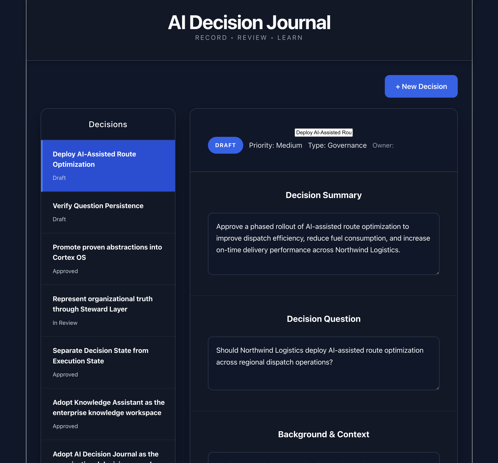
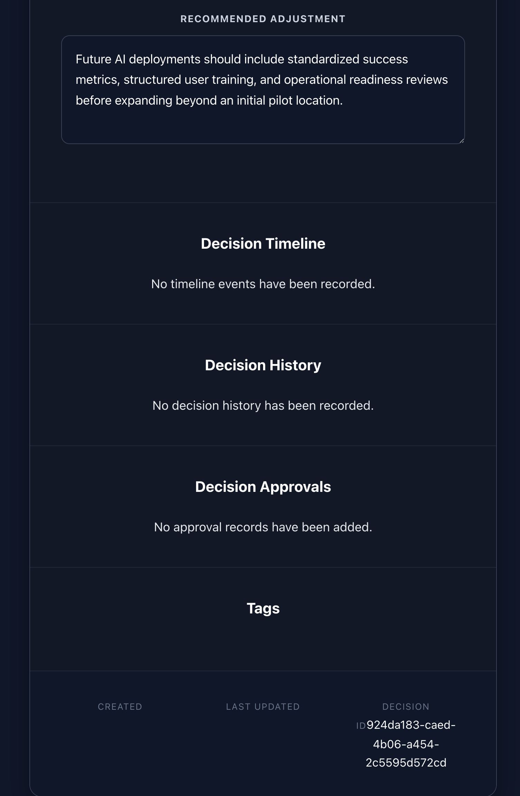
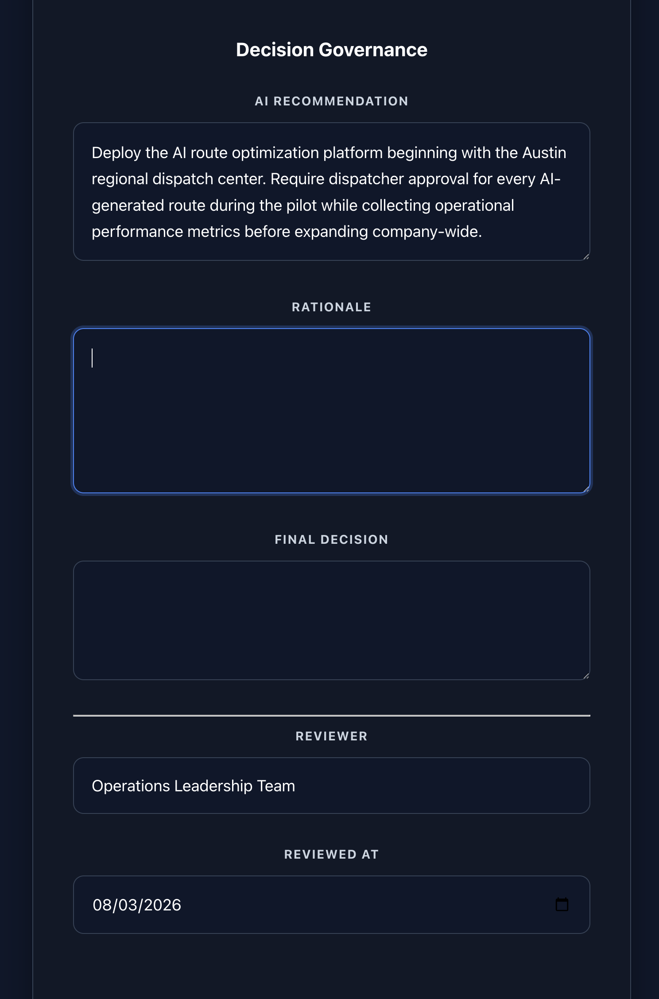
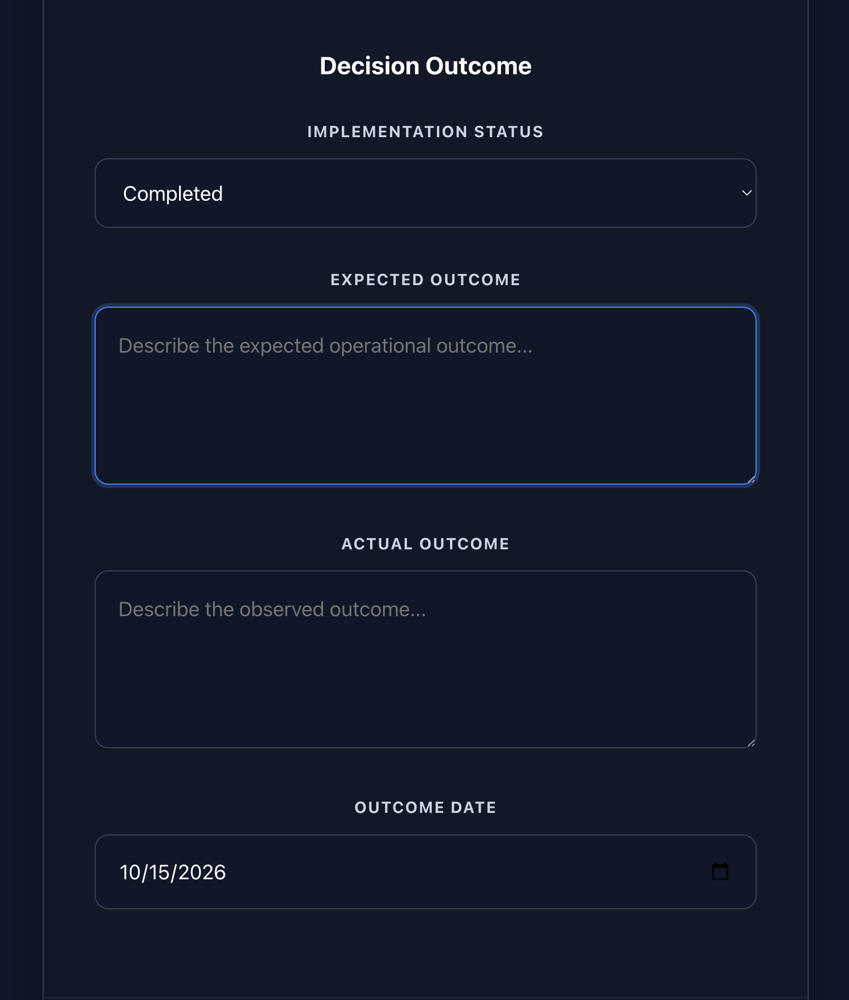
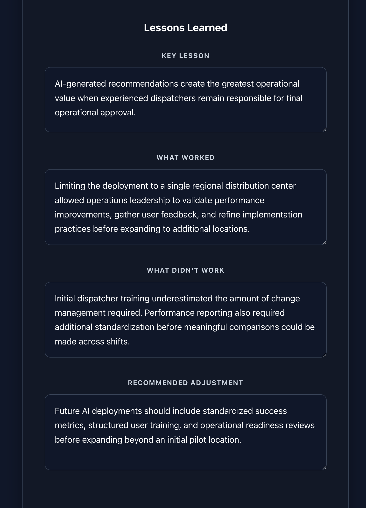

# AI Decision Journal

> **Enterprise decision intelligence workspace for governing, documenting, and preserving organizational decision-making.**

---



**Built with:** React • Node.js • Express • Supabase • PostgreSQL

---

# Overview

AI Decision Journal is an enterprise decision intelligence application that helps organizations capture, govern, and preserve important business decisions throughout their lifecycle.

Rather than treating decisions as temporary conversations scattered across meetings, emails, chat messages, and spreadsheets, the application provides a structured workspace where organizational context, supporting evidence, AI recommendations, human governance, implementation outcomes, and lessons learned become durable organizational records.

Instead of asking teams to simply remember why a decision was made months later, AI Decision Journal preserves the complete decision narrative so organizations can understand not only **what** was decided, but **why** it was decided and **what** happened afterward.

---

# Highlights

- Structured enterprise decision workspace
- AI-assisted decision governance
- Human review and approval workflow
- Operational outcome tracking
- Lessons learned and organizational learning
- Persistent decision records
- Layered enterprise architecture
- Supabase-backed persistence

---

# Screenshots

## Enterprise Decision Workspace



The primary workspace captures the complete lifecycle of an organizational decision, from proposal through operational outcome.

---

## Decision Governance



Document AI recommendations, human review, rationale, and final organizational decisions within a governed workflow.

---

## Operational Outcomes



Track implementation status, expected outcomes, actual outcomes, and post-implementation observations.

---

## Organizational Learning



Capture lessons learned so every completed decision improves future organizational decision-making.

---

# What This Project Demonstrates

This project demonstrates my approach to enterprise AI implementation and decision governance.

- Designing software around organizational decision-making rather than isolated records.
- Modeling business decisions as durable organizational assets.
- Separating governance, outcomes, organizational learning, and persistence into modular components.
- Applying layered architecture and repository patterns to enterprise business workflows.
- Building software that preserves organizational reasoning instead of only operational data.

---

# Why I Built This

Organizations preserve many different kinds of organizational information.

They preserve:

- Documents
- Policies
- Standard Operating Procedures
- Project Plans
- Technical Specifications

Yet one of the most valuable organizational assets is often lost:

**Why important decisions were made.**

Months later, organizations frequently ask:

- Why was this approved?
- What evidence supported the recommendation?
- Who reviewed the decision?
- What actually happened after implementation?
- What should we do differently next time?

AI Decision Journal explores a different approach.

Instead of treating decisions as temporary conversations, it treats them as governed organizational assets that can be reviewed, understood, and learned from long after implementation.

---

# Design Principles

AI Decision Journal is built around five design principles.

### Decisions are organizational assets.

Important business decisions deserve the same level of stewardship as organizational knowledge and documentation.

---

### Governance should be transparent.

AI recommendations, human review, and final decisions should remain visible and understandable.

---

### AI supports human judgment.

Artificial intelligence informs organizational decisions without replacing human responsibility or accountability.

---

### Outcomes matter.

The value of a decision is measured not only by its recommendation, but by its implementation and operational results.

---

### Every decision should improve future decisions.

Completed decisions become organizational learning that informs future governance.

---

# Decision Lifecycle

```text
Decision Proposal
        │
        ▼
Business Context
        │
        ▼
Supporting Evidence
        │
        ▼
AI Recommendation
        │
        ▼
Human Governance
        │
        ▼
Implementation
        │
        ▼
Operational Outcome
        │
        ▼
Lessons Learned
```

---

# Features

## Decision Library

Browse and manage organizational decisions from a centralized workspace.

---

## Decision Workspace

Document every aspect of an organizational decision, including:

- Executive Summary
- Decision Question
- Business Context

---

## Decision Governance

Capture the complete governance process.

Includes:

- AI Recommendation
- Human Review
- Final Decision
- Reviewer
- Review Date

---

## Operational Outcomes

Track implementation after approval.

Supports:

- Implementation Status
- Expected Outcome
- Actual Outcome
- Outcome Date

---

## Organizational Learning

Every completed decision contributes to future organizational knowledge through structured lessons learned.

---

# Architecture

## Frontend

```text
App.jsx
│
├── Decision Library
├── Decision Workspace
├── Governance
├── Outcomes
├── Lessons
├── Timeline
├── History
└── Metadata
```

Presentation responsibilities remain isolated while the application coordinates persistence through application services.

---

## Backend

```text
React UI
      │
      ▼
Application Services
      │
      ▼
Repositories
      │
      ▼
Persistence Layer
      │
      ▼
Supabase
```

Business responsibilities remain isolated from persistence and infrastructure concerns through a layered architecture.

---

# Decision Aggregate

Each Decision represents a governed business aggregate composed of:

```text
Decision

├── Identity
├── Summary
├── Question
├── Context
├── Evidence
├── Governance
├── Outcome
├── Lessons
├── Timeline
├── History
├── Approvals
├── Tags
└── Metadata
```

The application edits a working Decision aggregate before persisting changes through the application layer.

---

# Engineering Challenges

This project explores several architectural challenges common to enterprise business systems.

- Modeling organizational decisions as aggregate roots.
- Preserving organizational reasoning instead of isolated business records.
- Separating governance from implementation.
- Applying layered architecture to business workflows.
- Designing an extensible decision lifecycle that can evolve over time.

---

# Technology Stack

### Frontend

- React
- Vite

### Backend

- Node.js
- Express

### Database

- Supabase
- PostgreSQL

### Architecture

- Layered Architecture
- Repository Pattern
- Application Services
- Domain Model
- Aggregate Modeling
- Persistence Mapping

---

# Portfolio Architecture

AI Decision Journal is one component within a broader organizational intelligence ecosystem.

```text
Knowledge Assistant
(Organizational Knowledge)

        │
        ▼

AI Decision Journal
(Organizational Decisions)

        │
        ▼

SynapseFlow
(Trusted Organizational Execution)

        │
        ▼

Steward Layer
(Organizational Intelligence)
```

Each product owns a distinct organizational responsibility while remaining loosely coupled through clean architectural boundaries.

---

# Project Status

## Completed

- Decision Library
- Editable Decision Workspace
- Decision Governance
- Operational Outcome Tracking
- Lessons Learned
- Layered Architecture
- Repository Pattern
- Application Services
- Supabase Persistence
- Multi-Decision Support

---

# Roadmap

Future improvements may include:

- Knowledge Assistant evidence integration
- Evidence search and attachment
- Editable timeline management
- Decision approval workflows
- Decision history generation
- Organizational analytics
- Search and filtering
- Cross-product APIs
- Steward Layer integration

---

# Running the Project

## Install

### Frontend

```bash
cd client
npm install
```

### Backend

```bash
cd server
npm install
```

---

## Start

### Backend

```bash
cd server
npm run dev
```

### Frontend

```bash
cd client
npm run dev
```

---

# About This Project

AI Decision Journal was built as a portfolio project exploring enterprise AI implementation, decision governance, and organizational intelligence.

Rather than functioning as a simple CRUD application for recording decisions, the project explores how organizations can preserve decision context, governance, implementation outcomes, and institutional learning as durable organizational assets. The emphasis is on business architecture, transparent governance, and long-term organizational memory.

---

# License

This repository is provided for portfolio and educational purposes.

Please do not redistribute substantial portions of the project without permission.

---

# Author

**Anson O'Connor**

AI Implementation & Workflow Systems Architect

Austin, Texas

**LinkedIn:** https://www.linkedin.com/in/anson-o-connor-2404b4282

**Website:** https://www.synapseflowsystems.com